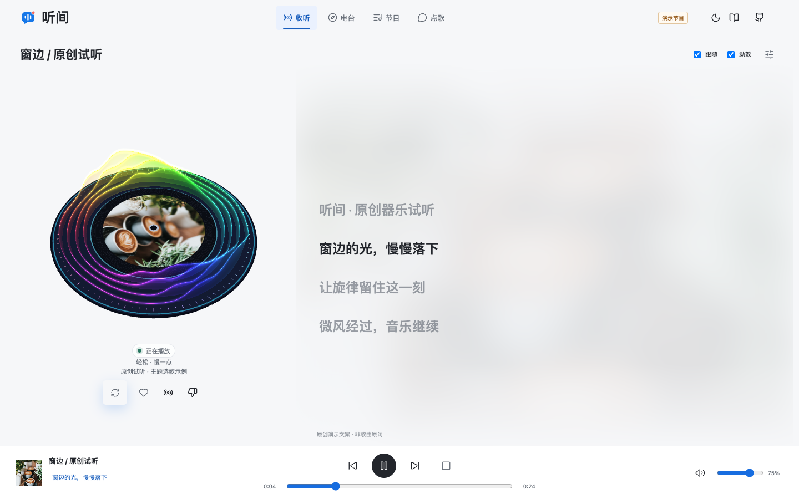
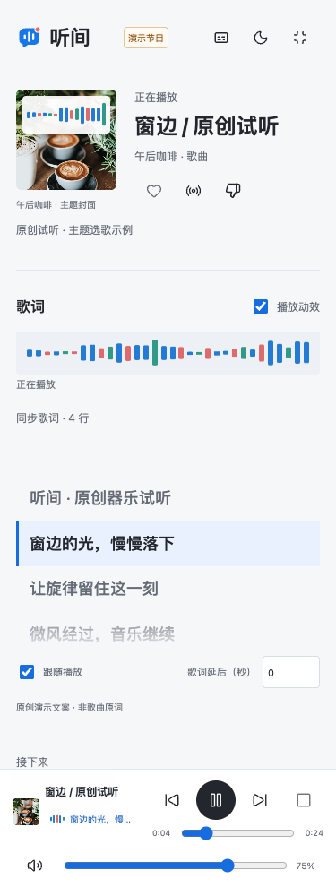
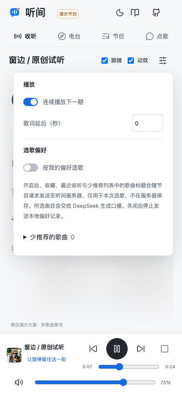
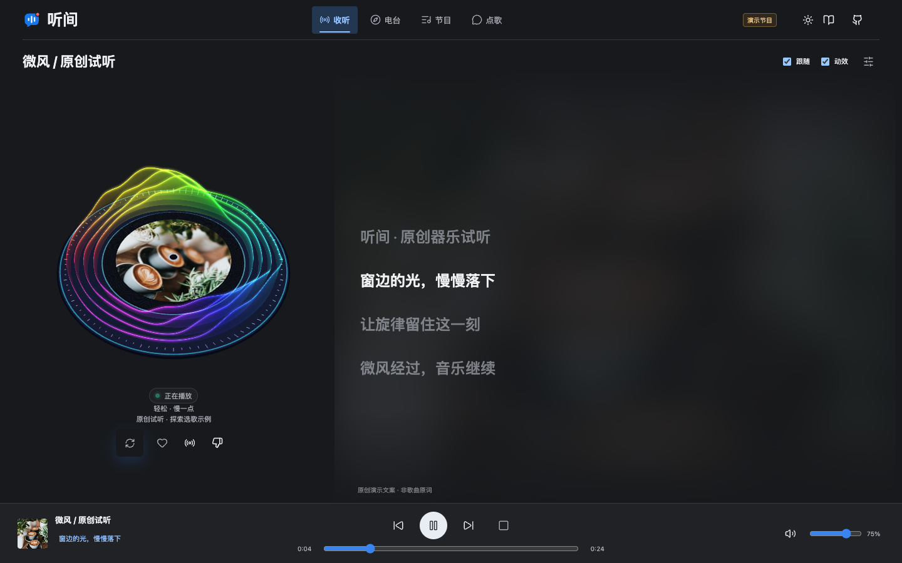
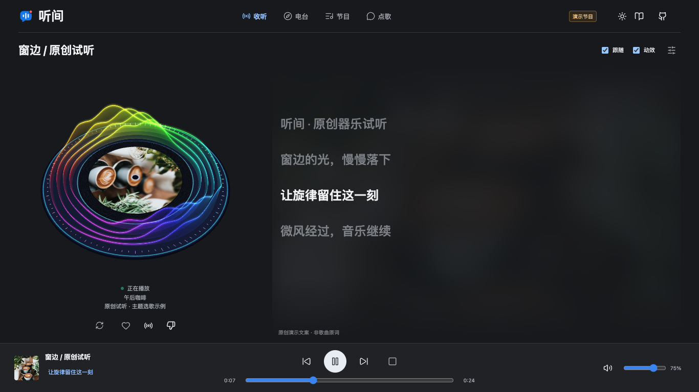
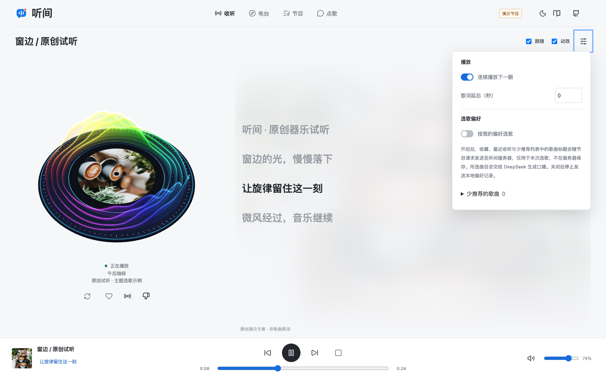

<a id="top"></a>

<p align="center">
  
</p>

<h1 align="center">听间 · Tingjian</h1>

<p align="center"><strong>选一个主题，把接下来的时间交给音乐。</strong></p>

<p align="center">
  
  
  
  <a href="https://github.com/HachikoJ/easy-radio-host"></a>
</p>

<p align="center">
  <a href="https://audio.deline.top">在线收听</a> · <a href="README.en.md">English</a> · <a href="https://www.deline.top">个人官网</a>
</p>

<p align="center">
  <a href="#核心体验">核心体验</a> · <a href="#产品预览">产品预览</a> · <a href="#如何运行">如何运行</a> · <a href="#项目资料">项目资料</a> · <a href="#联系作者">联系作者</a>
</p>

听间是一个面向喜欢主题听歌、愿意自行部署的听众的 AI 音乐电台。推荐引擎结合主题和可选偏好选歌，主持人「小蓝」串联话题并合成口播，浏览器连续播放「口播 → 歌曲 → 口播」。歌曲来自在线音乐 API，无需准备本地音乐文件。

**项目地址：** [HachikoJ/easy-radio-host](https://github.com/HachikoJ/easy-radio-host)

**在线收听：** [audio.deline.top](https://audio.deline.top)，选择主题后点击「开始收听」。也可按下方步骤自行部署。

## 核心体验

- **六个主题**：午后咖啡、城市漫游、深夜安眠、怀旧金曲、元气早班、心情小站；程序筛选歌曲，DeepSeek 按选定顺序编排口播。
- **多路推荐**：融合主题、收藏歌曲、收藏歌手、部署者配置的歌手偏好及探索候选；支持从当前歌曲延伸同歌手作品，展示实际选歌依据。
- **去重与多样性**：一期内歌曲不重复，优先避开最近播放并分散歌手；候选不足时缩短节目，必要的近期回补和歌手限制放宽会标明。
- **自主偏好**：收听设置集中放置连续播放、译文、歌词时差与选歌偏好。「按我的偏好选歌」默认关闭；开启后才将本地收藏、历史和「少推荐」标题用于本次推荐，开启前可查看隐私说明。「少推荐」可撤回，普通跳过与播放失败不视为不喜欢，主动点歌仍可播放指定歌曲。
- **主持人口播**：MiniMax 默认使用 `Chinese (Mandarin)_Warm_Girl`，支持 edge-tts 降级。新生成的口播通过 ffmpeg 平衡响度，歌曲以主音量的 85% 播放，减少口播与歌曲切换时的音量落差；缺少 ffmpeg 或处理失败时保留原口播。
- **连续播放**：节目单、上一段与下一段、进度和音量控制，支持自动续播与停止。
- **专注收听**：统一的收听页随视口高度分配唱片与歌词空间，主要内容保持一屏；歌曲标题与右对齐的跟随、动效和设置同处一行。主题电台、节目/收藏/历史与点歌互动按需展开，底部播放控制始终可用。支持明暗配色、键盘及兼容浏览器的系统媒体控制。右上角的致谢和作者 GitHub 在新标签页打开，致谢默认中文，点击 English 后展示英文。
- **收藏与历史**：浏览器本地保存最多 100 首收藏、50 条按标题去重的收听历史；歌曲实际开始播放后才记入历史。
- **点歌互动**：与小蓝聊天、点歌或控制播放；支持生成取消、失败重试和失败时保留输入草稿。
- **在线曲库**：推荐和点歌入队前检查真实音频；按歌名、歌手和版本跨渠道检索，支持繁简匹配、多个候选及分页。播放失败先刷新，再寻找其他匹配音源；确认无可用匹配时明确提醒并继续下一段。遇到限流、超时或检索未完成时单独提示并保留重试，不误报歌曲不存在。
- **同步歌词**：大面积歌词区默认可见，以淡化的主题照片为背景，用文字高亮呈现当前行，歌词在区域内独立滚动；主持人讲话时在同一区域展示口播文稿。底部播放器显示当前歌词，点按可聚焦歌词区并恢复跟随。LRC 默认跟随播放，点按可跳播（含 0 秒）；手动浏览后 3 秒恢复跟随，只有主动关闭跟随开关才持续停止。支持 -10 至 +10 秒延后调整和可选的时间戳译文。加载、无歌词、请求失败及超时分别提示，纯文本不猜测时间。
- **播放动效**：旋转唱片中央展示主题图片，外围黑色圆环承托彩色发光沿线与多层半透明立体波幕。浏览器与音源支持时，波幕随实际频段、低频和音量延绵起伏；无法分析时使用平滑播放动画，不支持 WebGL 时显示二维涟漪。等待、暂停或页面隐藏时停止，记住动效开关并尊重系统减少动态效果设置；主题图片不是歌曲专辑封面。

## 产品预览

### 桌面端

<p align="center">
  <a href="docs/radio-desktop.png"></a>
</p>

### 移动端

<table>
  <tr>
    <th width="33%">收听</th>
    <th width="33%">歌词与动效</th>
    <th width="33%">收听设置</th>
  </tr>
  <tr>
    <td align="center" valign="top"><a href="docs/radio-mobile.png"></a></td>
    <td align="center" valign="top"><a href="docs/radio-lyrics-mobile.png"></a></td>
    <td align="center" valign="top"><a href="docs/radio-recommendations-mobile.png"></a></td>
  </tr>
</table>

<details>
<summary>更多桌面截图：深色模式、歌词与动效、收听设置</summary>

#### 深色模式

<p align="center">
  <a href="docs/radio-focus.png"></a>
</p>

#### 歌词与动效

<p align="center">
  <a href="docs/radio-lyrics.png"></a>
</p>

#### 收听设置

<p align="center">
  <a href="docs/radio-recommendations.png"></a>
</p>

</details>

截图来自明确标注的演示模式，展示实际界面，使用原创器乐与原创演示文案，不收录第三方歌曲原词。主题摄影用于表达收听场景，并非歌曲的真实唱片封面。演示中的固定曲目和理由仅用于预览，不代表真实服务的推荐效果；[正式站点](https://audio.deline.top) 的在线曲目和可用性由第三方服务决定。点击截图可查看原图。

## 工作原理

```text
浏览器
  → 主应用 :8100
      → 多路候选融合、近期过滤、去重与歌手分散
      → DeepSeek 按选定歌曲顺序编排口播
      → MiniMax / edge-tts 合成口播
      → 在线曲库代理 :8001 读取歌单
  ← 口播与歌曲播放清单
  → 曲库代理复核音频并流转发，支持进度拖动
```

曲库代理读取 `musiclib/playlist.tsv`，通过 `/songs.txt` 提供候选目录，`POST /resolve` 完成匹配与音频校验。网页使用 `/s/<source>/<id>.mp3?stream=1` 转发音频，避免第三方 CDN 跨域限制导致播放器与校验结果不同；不带 `stream` 时保留原 307 跳转。歌曲音频不落盘，生成的口播文件保存在服务端 `DATA_DIR/voice/`（腾讯云部署为 `/var/lib/tingjian/voice/`）。

GD Studio 列出的 10 个渠道会按实际开放情况参与检索，并不代表全部渠道始终可用。搜索、取链和歌词共享每 5 分钟最多 50 次的本地请求预算，使用缓存、并发去重和不支持渠道冷却减少消耗；上游仍可能限流。只有通过校验的歌曲才能入队，但后续网络变化和链接过期仍需播放时恢复。详见 [音源检索与恢复](docs/MUSIC-SOURCES.md)。

推荐仅使用当前曲库及可用元数据，不连接 Embeat 的模型、向量库或数据集。主题匹配使用本项目策划的标签，不声称是声学分析或协同过滤。默认选取 4 首，候选不足时缩短；模型失败时仍按同一选歌结果生成模板口播。详细规则、隐私边界和验证方法见 [推荐设计与 Embeat 参考说明](docs/EMBEAT-ADAPTATION.md)。

## 如何运行

需要 Python 3.10+；安装 ffmpeg 可启用新口播的响度归一化。完整的 Linux 部署步骤、systemd 配置和故障排查见 [部署手册](DEPLOY-HANDOFF.md)。

```bash
git clone https://github.com/HachikoJ/easy-radio-host.git
cd easy-radio-host
python3 -m venv .venv
source .venv/bin/activate
python -m pip install -r backend/requirements.txt zhconv
```

1. 按部署手册创建 `/etc/tingjian/radio.env`，配置 DeepSeek、MiniMax 和服务地址，密钥文件权限设为 600。
2. 启动主应用（8100）与在线曲库代理（8001），两项服务仅监听 `127.0.0.1`。
3. 配置 Nginx 与 HTTPS，通过同一域名访问页面、`/api/`、`/voice/` 和 `/music/`，生成一期节目。公网只需开放 80、443。

### 无密钥体验界面

已安装 Node.js 22+ 时，可直接启动不依赖第三方服务的本地演示：

```bash
node scripts/serve-demo.mjs
```

打开 [本地演示](http://127.0.0.1:8131/?demo=1)。只有显式添加 `?demo=1` 才启用固定演示节目；演示不会调用 AI 或音乐 API，也不代表在线服务可用性。正式使用仍按上述步骤部署主应用。

演示使用原创合成器乐与明确标注的原创演示文案，歌词区域展示的文案不是歌曲原词。

### 主要配置

| 变量 | 用途 |
| --- | --- |
| `DEEPSEEK_KEY` | 节目编排与对话的 API Key |
| `MINIMAX_KEY` | 主持人口播的 API Key |
| `MINIMAX_VOICE` | 主持人音色，默认 `Chinese (Mandarin)_Warm_Girl` |
| `NAS_LIST_URL` | 曲库列表地址，通常为 `http://127.0.0.1:8001/songs.txt` |
| `NAS_BASE_URL` | 浏览器可以访问的在线曲库代理地址 |
| `RADIO_BASE` | 浏览器可以访问的主应用地址 |
| `DATA_DIR` | 口播和运行数据目录 |

`NAS_*` 是保留的兼容变量名，指向在线曲库代理。远程浏览器无法访问服务器自身的 `127.0.0.1`，对外播放地址须使用服务器的可访问地址。

响度处理使用 ffmpeg 两遍 `loudnorm`，目标为 -14 LUFS、真峰值上限 -1.5 dBTP，并启用 `dual_mono`。缺少 ffmpeg、处理超时或失败时使用原音，不阻断口播播放。此处理只作用于新生成的口播，不重新处理旧口播或第三方歌曲；歌曲的 0.85 音量系数不改变音量滑杆显示值，也不保证所有音源听感完全一致。

## API

| 服务 | 方法 | 路径 | 说明 |
| --- | --- | --- | --- |
| 主应用 :8100 | POST | `/api/show` | 生成节目播放清单 |
| 主应用 :8100 | POST | `/api/intent` | 前端对话、点歌与播放控制 |
| 主应用 :8100 | POST | `/api/chat` | 保留的对话与点歌兼容接口 |
| 主应用 :8100 | GET | `/voice/*.mp3` | 主持人口播 |
| 曲库代理 :8001 | GET | `/songs.txt` | 在线歌单元数据 |
| 曲库代理 :8001 | GET | `/s/<source>/<id>.mp3` | 获取直链并跳转 |
| 同域 `/music/` → 曲库代理 :8001 | GET | `/music/lyrics/{source}/{song_id}.json` | 获取当前歌曲歌词及可用译文；代理直连路径为 `/lyrics/{source}/{song_id}.json` |

`POST /api/show` 保留原有 `theme` 和 `exclude`，新增可选 `recommendation`：

```json
{
  "theme": "午后咖啡",
  "exclude": [],
  "recommendation": {
    "personalize": false,
    "favorites": [],
    "history": [],
    "disliked": [],
    "seed": ""
  }
}
```

`favorites`、`history`、`disliked` 为标题数组，仅在 `personalize: true` 时参与推荐；`seed` 为主动选择的同歌手延伸起点标题。歌曲项的 `recommendation.sources` 和 `recommendation.reason` 返回实际候选来源与推荐理由，`meta.recommendation` 提供候选和降级信息。旧客户端可省略新增字段；主动点歌仍使用 `/api/intent`。

## 歌单维护

在部署目录 `/opt/easy-radio-host` 编辑 `musiclib/playlist-source.tsv`，每行填写「歌名 + Tab + 歌手」。备份现有的 `musiclib/playlist.tsv` 后运行：

```bash
/opt/easy-radio-host/.venv/bin/python3 /opt/easy-radio-host/musiclib/resolve_multi.py
```

脚本会重写解析结果，搜索多音源、过滤版本并检查候选播放地址。匹配结果和可播性仍受第三方服务影响，请复核未命中或版本不符的歌曲。

## 隐私与限制

- API Key、Cookie 和 `radio.env` 不得提交到 GitHub。
- 节目主题、对话和曲目元数据会发送至相关 AI 或音乐服务；口播音频与运行数据保存在服务端。
- 收藏、历史和「少推荐」记录保存在当前浏览器，不跨设备同步；演示与正式记录隔离。清除浏览器站点数据会丢失这些记录，禁用本地存储时仅在当前页面保留。
- 「按我的偏好选歌」默认关闭。开启后，收藏、历史和「少推荐」标题随每次节目请求发往听间服务器，仅在本次请求中使用，不新增服务端偏好档案。DeepSeek 只接收选定歌曲及节目上下文，不接收这些完整偏好列表；关闭后不再发送这些本地偏好。当前会话的近期歌曲仍用于减少重复，同歌手延伸会发送主动选定的起点标题。
- 服务器已有的全局歌手偏好配置属于部署者配置，不是每位听众的独立档案；推荐理由会区分该来源与浏览器本地收藏。
- 再次点播会按标题重新请求匹配与播放地址；收藏不保存精确歌曲 ID 或永久音频链接，可能匹配到不同版本。
- DeepSeek、MiniMax 等服务可能产生费用，价格与额度以各服务商为准。
- AI 生成的口播不保证事实准确；歌曲可用性、版本匹配和响应时间依赖第三方服务。
- 歌词与译文来自现有 GD 音乐 API，可能缺失或与音频版本不匹配；有时间戳才启用同步，不推算纯文本歌词时间。代理只在内存中缓存最多 128 条、每条 300 秒，不保存歌词文件或随仓库再分发歌词库；歌词版权归原权利人。
- 本项目用于个人学习与体验，歌曲版权归相应权利人，使用时须遵守平台规则。
- 项目处于实验阶段，目前未确认上游代码的完整授权条款，仓库尚未声明统一开源许可证。

## 项目资料

- [部署手册](DEPLOY-HANDOFF.md)：服务配置、歌单维护和排障。
- [贡献指南](CONTRIBUTING.md)：验证命令与 Pull Request 规范。
- [行为准则](CODE_OF_CONDUCT.md) · [安全政策](SECURITY.md)。
- [更新记录](CHANGELOG.md) · [协作约定](AGENTS.md)。
- [设计约定](DESIGN.md) · [第三方来源与许可记录](THIRD_PARTY_NOTICES.md)。
- [推荐设计与 Embeat 参考说明](docs/EMBEAT-ADAPTATION.md)：候选融合、边界、降级规则与评测。
- [持续集成](https://github.com/HachikoJ/easy-radio-host/actions)：Python 语法、接口契约及前端静态服务检查。

## 致谢

- [easy-radio-host 原始项目](https://gitee.com/weak0001/easy-radio-host)，作者 `weak0001`；保留原作者署名与版权归属。
- [GD Studio](https://github.com/gdstudio-org)：提供核心[在线音乐 API](https://music-api.gdstudio.xyz/api.php)，用于多音源搜索、播放地址解析与歌词获取；其 [Embeat](https://github.com/gdstudio-org/Embeat/tree/7617a505ec42f109685802d1a3319e1957ac0a99) 为多路候选融合、去重、多样性控制及可解释推荐提供思路。推荐逻辑由听间独立实现，未复制其源码、模型、数据或品牌；许可范围差异详见[参考记录](THIRD_PARTY_NOTICES.md#embeat)。
- [lrc-kit 1.2.1](https://www.npmjs.com/package/lrc-kit/v/1.2.1)，Copyright (c) 2016 Weirong Xu，MIT；用于解析 LRC，保留[完整许可](backend/static/vendor/lrc-kit/LICENSE)和[源码改动记录](THIRD_PARTY_NOTICES.md#lrc-kit)。
- [Three.js 0.170.0](https://github.com/mrdoob/three.js/tree/r170)，Copyright © 2010-2024 three.js authors，MIT；本地模块用于渲染立体唱片与波幕，保留[完整许可](backend/static/vendor/three/LICENSE)。
- [Lucide](https://lucide.dev) 提供 ISC 授权的界面图标；[Unsplash](https://unsplash.com) 提供主题摄影，逐图来源见[资产来源](backend/static/assets/SOURCES.md)。
- DeepSeek、MiniMax、edge-tts 及其他第三方依赖；其权利和使用条款归各自权利人。

## GitHub 关注度

[](https://star-history.com/#HachikoJ/easy-radio-host&Date)

[查看独立 Star History](https://star-history.com/#HachikoJ/easy-radio-host&Date)

## 联系作者

交流 AI 音乐产品、反馈使用体验或支持项目，可以通过以下方式联系：

- 个人官网：[www.deline.top](https://www.deline.top)
- GitHub：[HachikoJ](https://github.com/HachikoJ) · [提交问题](https://github.com/HachikoJ/easy-radio-host/issues)
- 微信：`hostrow`，添加时请备注「听间」
- 邮箱：[946106011@qq.com](mailto:946106011@qq.com)

<table>
  <tr>
    <td align="center" valign="top" width="33%">
      <strong>微信联系</strong><br><br>
      <a href="assets/wechat-contact.png"></a>
    </td>
    <td align="center" valign="top" width="33%">
      <strong>微信赞赏</strong><br><br>
      <a href="assets/donate-wechat.png"></a>
    </td>
    <td align="center" valign="top" width="33%">
      <strong>支付宝赞赏</strong><br><br>
      <a href="assets/donate-alipay.png"></a>
    </td>
  </tr>
</table>

## 加入交流群

交流使用经验、分享想听的主题，也欢迎反馈问题。

<p align="center">
  <a href="assets/group-qr.jpg"></a>
</p>

<p align="right"><a href="#top">返回顶部</a></p>
